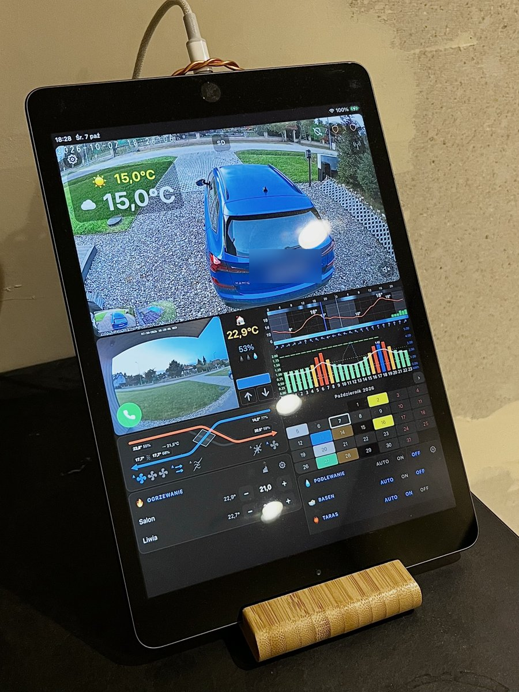

### Hi, I'm Tymoteusz 👋

**Linux servers since I was a teenager** — ISPs, hosting, infrastructure. **Programming from Pascal and assembler to AI agents.**

I love **electricity in every form** — from home heating and dynamic energy prices to passive houses, which I'm passionate about. I also work with **subtle energies** as a lightworker: Reiki, Kundalini and other multidimensional energies.

Away from the keyboard I build things with my hands: **custom furniture** (wardrobes, fitted kitchens), **tiling** and general construction work. As a teenager I spent most of my time on a bike.

Since COVID started I go **winter swimming** in ice-cold water. Colds and sinus infections were with me for 40 years — now they are gone. **The human body can heal itself!**

---

**[TymOS](https://github.com/tymoteuszrogalewski/tymos)** — my main project: a super-fast, lightweight smart home on a Raspberry Pi, running my house every day.

**Smaller tools from it:**

<table>
<tr><td width="50%" valign="top"><a href="https://github.com/tymoteuszrogalewski/zehnder-comfoair-q-esp32"><b>zehnder-comfoair-q-esp32</b></a> Control a Zehnder ComfoAir Q ventilation unit with an ESP32 and CAN bus (ESPHome) — permanent fan speeds, PHP control over REST, no extra Zehnder modules.</td><td width="50%" valign="top"><a href="https://github.com/tymoteuszrogalewski/weather-widget"><b>weather-widget</b></a> Tiny 48-hour weather chart in one PHP file — temperature, rain (median of 5 models), snow, clouds and wind, readable from a distance.</td></tr>
<tr><td width="50%" valign="top"><a href="https://github.com/tymoteuszrogalewski/pstryk-api"><b>pstryk-api</b></a> Hourly dynamic electricity prices, usage and costs from the Pstryk API into MySQL / MariaDB or CSV — today + tomorrow, cheap hours, PV.</td><td width="50%" valign="top"><a href="https://github.com/tymoteuszrogalewski/tge-rdn"><b>tge-rdn</b></a> Polish Power Exchange (TGE) day-ahead prices into MySQL / MariaDB or CSV — Fixing I and II, continuous trading, tomorrow's prices.</td></tr>
<tr><td width="50%" valign="top"><a href="https://github.com/tymoteuszrogalewski/energa-mojlicznik"><b>energa-mojlicznik</b></a> Hourly electricity usage from Energa "Mój Licznik" into MySQL / MariaDB or CSV — import, PV export, full history.</td><td width="50%" valign="top"><a href="https://github.com/tymoteuszrogalewski/blebox-energy-meter"><b>blebox-energy-meter</b></a> Local (no cloud) reader for the BleBox 3-phase energy meter, e.g. Pstryk — power, voltage and current per phase every few seconds.</td></tr>
</table>

All code written by Claude AI — I bring the ideas and the direction.
